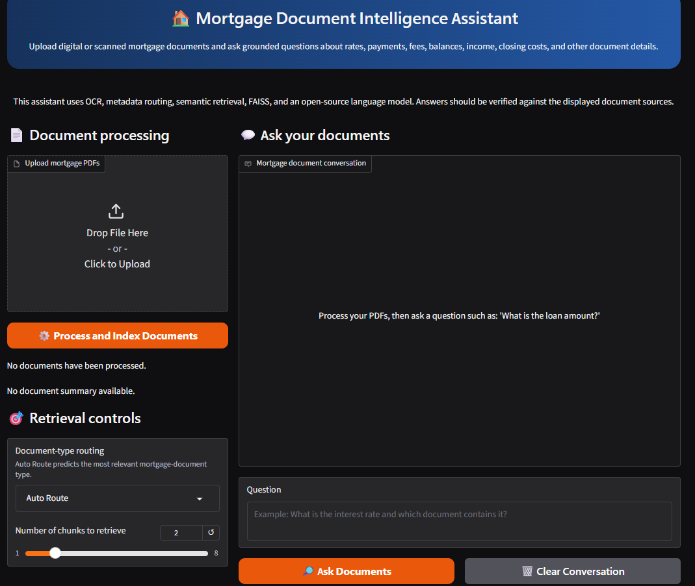
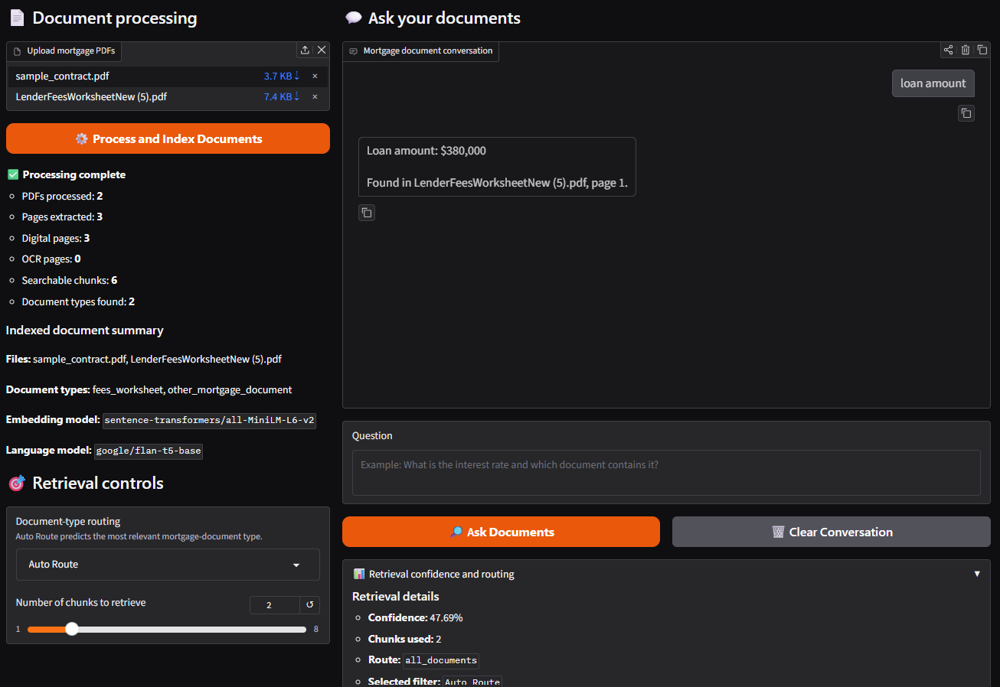
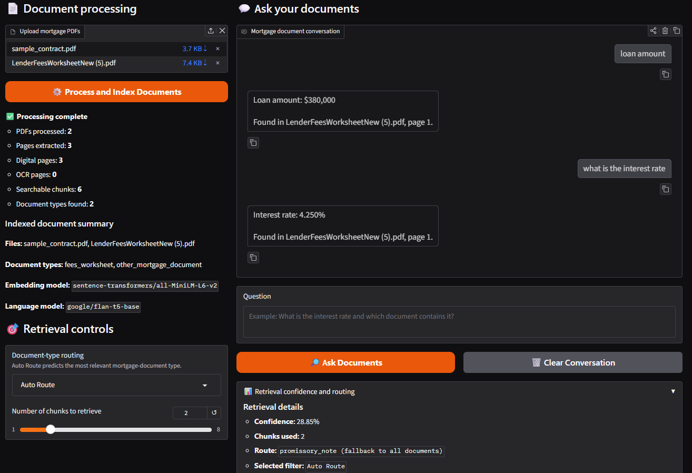

<div align="center">

# 🏠 Mortgage Document Intelligence System

### End-to-End RAG Pipeline for Intelligent Mortgage Document Processing


*An end-to-end document intelligence prototype for processing complete mortgage document packages using OCR, semantic search, Retrieval-Augmented Generation (RAG), and conversational AI.*

</div>

---

# 📖 Overview

Mortgage loan packages contain large amounts of financial information spread across multiple pages and document types. Reviewing these documents manually is time-consuming and prone to human error.

This project demonstrates how modern AI can automate mortgage document understanding by combining:

- 📄 OCR for scanned documents
- 🧠 Semantic embeddings
- ⚡ FAISS vector search
- 🤖 Retrieval-Augmented Generation (RAG)
- 💬 Conversational question answering

Users can upload mortgage documents and ask natural language questions while receiving grounded answers with document citations.

---

# 🎯 Project Objectives

✔ Process digital and scanned mortgage PDFs

✔ Extract text using OCR

✔ Clean and preprocess extracted text

✔ Generate semantic embeddings

✔ Build a searchable FAISS vector database

✔ Retrieve relevant document sections

✔ Generate grounded answers using an open-source LLM

✔ Return document citations

---

# 🏗️ System Architecture

```text
Mortgage PDFs
      │
      ▼
PyMuPDF + Tesseract OCR
      │
      ▼
Text Cleaning
      │
      ▼
Chunking
      │
      ▼
Sentence Transformers
(all-MiniLM-L6-v2)
      │
      ▼
FAISS Vector Index
      │
      ▼
Semantic Retrieval
      │
      ▼
Context Builder
      │
      ▼
FLAN-T5 Base
      │
      ▼
Answer + Source Citation
      │
      ▼
Gradio Chatbot
```

---

# 🚀 Features

- 📄 Digital PDF processing
- 📷 OCR support for scanned documents
- 🧹 Text cleaning and preprocessing
- ✂️ Fixed-size overlapping chunking
- 🏷 Metadata tagging
- 🧠 Semantic embeddings
- ⚡ FAISS vector search
- 💬 Retrieval-Augmented Generation (RAG)
- 📑 Source-aware responses
- 🌐 Interactive Gradio chatbot

---

# 🛠️ Tech Stack

| Category | Tools |
|-----------|-------|
| Language | Python |
| PDF Processing | PyMuPDF |
| OCR | Tesseract OCR |
| Embeddings | sentence-transformers/all-MiniLM-L6-v2 |
| Vector Database | FAISS |
| LLM | FLAN-T5 Base |
| UI | Gradio |
| Libraries | Pandas, NumPy, Hugging Face Transformers |

---

# 📂 Project Workflow

```text
Upload Mortgage PDF
          │
          ▼
Extract Text
(PyMuPDF + OCR)
          │
          ▼
Clean & Chunk Text
          │
          ▼
Generate Embeddings
          │
          ▼
Store in FAISS
          │
          ▼
User Question
          │
          ▼
Retrieve Relevant Chunks
          │
          ▼
Build Prompt
          │
          ▼
FLAN-T5 Base
          │
          ▼
Answer + Citation
```

---

# 💬 Example Queries

```text
What is the loan amount?

What is the interest rate?

What are the origination charges?

How much cash is needed to close?

Who is the lender?
```

---

# 📊 Example Output

### Query

```
What is the interest rate?
```

### Retrieved Context

```
LenderFeesWorksheetNew (5).pdf
Page 1
```

### Response

```
Interest Rate: 4.250%

Source:
LenderFeesWorksheetNew (5).pdf
Page 1
```

---

# 📸 Demo

## Gradio Interface




## Loan Amount Example



## Interest Rate Example



# 📈 Current Capabilities

- Semantic document retrieval

- Mortgage field extraction

- Citation-aware responses

- Conversational document search

- Multiple PDF support

- OCR-enabled processing

---

<details>

<summary><strong>⚠ Current Limitations</strong></summary>

- Optimized for small document collections
- Complex layouts may require layout-aware parsing
- FAISS currently operates as an in-memory vector database
- No reranking or hybrid retrieval
- English-language mortgage documents only

</details>

---

<details>

<summary><strong>🚀 Future Improvements</strong></summary>

- Hybrid Retrieval (Dense + BM25)

- Cross-Encoder Reranking

- Semantic Chunking

- Persistent Vector Databases

- Pinecone / ChromaDB integration

- Cloud deployment

- Authentication

- Evaluation metrics (Recall, Precision, MRR)

- Multi-document comparison

- Support for insurance and legal documents

</details>

---

# 🎓 Learning Outcomes

This project strengthened my understanding of:

- Retrieval-Augmented Generation (RAG)

- OCR and intelligent document processing

- Semantic embeddings

- Vector databases

- Prompt engineering

- Open-source LLM integration

- Building AI-powered document search systems

It also improved my debugging, system design, and end-to-end AI development skills.

---

# 💼 Portfolio Impact

This project demonstrates practical experience in:

- Artificial Intelligence

- Machine Learning

- Natural Language Processing

- Intelligent Document Processing

- Large Language Models

- Information Retrieval

- Production-style AI pipeline development

---

# 📁 Project Structure

```text
Mortgage-RAG/
│
├── data/
│   ├── mortgage_pdfs/
│
├── notebooks/
│
├── images/
│   ├── gradio_ui.png
│   ├── loan_amount_demo.png
│   └── interest_rate_demo.png
│
├── app.py
├── rag_pipeline.py
├── requirements.txt
└── README.md
```

---

# 👩‍💻 Author

**Yvonne Okafor**

**MS Computer Science**  
Georgia Southern University

### Interests

- Artificial Intelligence
- Machine Learning
- Natural Language Processing
- Retrieval-Augmented Generation
- Intelligent Document Processing
- Large Language Models

---

## ⭐ If you found this project useful, consider giving it a star!
